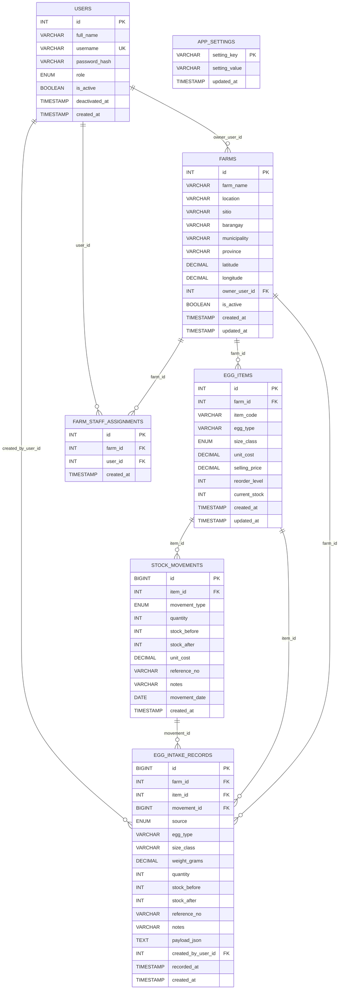

# Egg Monitoring ERD

## Diagram (Mermaid)

## FK Map

| Child table | Child column | Parent table | Parent column | On update | On delete |
|---|---|---|---|---|---|
| `farms` | `owner_user_id` | `users` | `id` | `CASCADE` | `SET NULL` |
| `egg_items` | `farm_id` | `farms` | `id` | `CASCADE` | `CASCADE` |
| `stock_movements` | `item_id` | `egg_items` | `id` | `CASCADE` | `CASCADE` |
| `egg_intake_records` | `farm_id` | `farms` | `id` | `CASCADE` | `CASCADE` |
| `egg_intake_records` | `item_id` | `egg_items` | `id` | `CASCADE` | `CASCADE` |
| `egg_intake_records` | `movement_id` | `stock_movements` | `id` | `CASCADE` | `CASCADE` |
| `egg_intake_records` | `created_by_user_id` | `users` | `id` | `CASCADE` | `SET NULL` |
| `farm_staff_assignments` | `farm_id` | `farms` | `id` | `CASCADE` | `CASCADE` |
| `farm_staff_assignments` | `user_id` | `users` | `id` | `CASCADE` | `CASCADE` |
