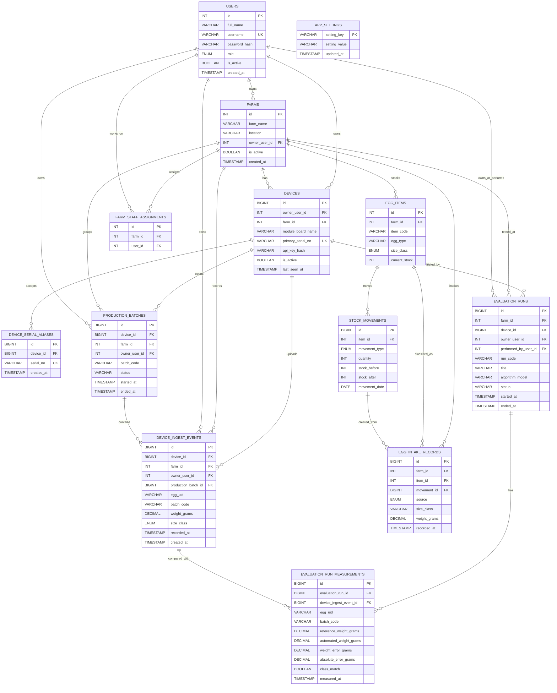

# Egg Monitoring ERD

## Diagram (Mermaid)

```mermaid
erDiagram
    USERS {
        INT id PK
        VARCHAR full_name
        VARCHAR username UK
        VARCHAR password_hash
        ENUM role
        BOOLEAN is_active
        TIMESTAMP created_at
    }

    FARMS {
        INT id PK
        VARCHAR farm_name
        VARCHAR location
        INT owner_user_id FK
        BOOLEAN is_active
        TIMESTAMP created_at
    }

    DEVICES {
        BIGINT id PK
        INT owner_user_id FK
        INT farm_id FK
        VARCHAR module_board_name
        VARCHAR primary_serial_no UK
        VARCHAR api_key_hash
        BOOLEAN is_active
        TIMESTAMP last_seen_at
    }

    DEVICE_SERIAL_ALIASES {
        BIGINT id PK
        BIGINT device_id FK
        VARCHAR serial_no UK
        TIMESTAMP created_at
    }

    DEVICE_INGEST_EVENTS {
        BIGINT id PK
        BIGINT device_id FK
        INT farm_id FK
        INT owner_user_id FK
        BIGINT production_batch_id FK
        VARCHAR egg_uid
        VARCHAR batch_code
        DECIMAL weight_grams
        ENUM size_class
        TIMESTAMP recorded_at
        TIMESTAMP created_at
    }

    PRODUCTION_BATCHES {
        BIGINT id PK
        BIGINT device_id FK
        INT farm_id FK
        INT owner_user_id FK
        VARCHAR batch_code
        VARCHAR status
        TIMESTAMP started_at
        TIMESTAMP ended_at
    }

    EVALUATION_RUNS {
        BIGINT id PK
        INT farm_id FK
        BIGINT device_id FK
        INT owner_user_id FK
        INT performed_by_user_id FK
        VARCHAR run_code
        VARCHAR title
        VARCHAR algorithm_model
        VARCHAR status
        TIMESTAMP started_at
        TIMESTAMP ended_at
    }

    EVALUATION_RUN_MEASUREMENTS {
        BIGINT id PK
        BIGINT evaluation_run_id FK
        BIGINT device_ingest_event_id FK
        VARCHAR egg_uid
        VARCHAR batch_code
        DECIMAL reference_weight_grams
        DECIMAL automated_weight_grams
        DECIMAL weight_error_grams
        DECIMAL absolute_error_grams
        BOOLEAN class_match
        TIMESTAMP measured_at
    }

    EGG_ITEMS {
        INT id PK
        INT farm_id FK
        VARCHAR item_code
        VARCHAR egg_type
        ENUM size_class
        INT current_stock
    }

    STOCK_MOVEMENTS {
        BIGINT id PK
        INT item_id FK
        ENUM movement_type
        INT quantity
        INT stock_before
        INT stock_after
        DATE movement_date
    }

    EGG_INTAKE_RECORDS {
        BIGINT id PK
        INT farm_id FK
        INT item_id FK
        BIGINT movement_id FK
        ENUM source
        VARCHAR size_class
        DECIMAL weight_grams
        TIMESTAMP recorded_at
    }

    FARM_STAFF_ASSIGNMENTS {
        INT id PK
        INT farm_id FK
        INT user_id FK
    }

    APP_SETTINGS {
        VARCHAR setting_key PK
        VARCHAR setting_value
        TIMESTAMP updated_at
    }

    USERS ||--o{ FARMS : "owns"
    USERS ||--o{ DEVICES : "owns"
    FARMS ||--o{ DEVICES : "has"
    DEVICES ||--o{ DEVICE_SERIAL_ALIASES : "accepts"
    DEVICES ||--o{ DEVICE_INGEST_EVENTS : "uploads"
    FARMS ||--o{ DEVICE_INGEST_EVENTS : "records"
    USERS ||--o{ DEVICE_INGEST_EVENTS : "owns"
    DEVICES ||--o{ PRODUCTION_BATCHES : "opens"
    FARMS ||--o{ PRODUCTION_BATCHES : "groups"
    USERS ||--o{ PRODUCTION_BATCHES : "owns"
    PRODUCTION_BATCHES ||--o{ DEVICE_INGEST_EVENTS : "contains"
    DEVICES ||--o{ EVALUATION_RUNS : "tested_by"
    FARMS ||--o{ EVALUATION_RUNS : "tested_at"
    USERS ||--o{ EVALUATION_RUNS : "owns_or_performs"
    EVALUATION_RUNS ||--o{ EVALUATION_RUN_MEASUREMENTS : "has"
    DEVICE_INGEST_EVENTS ||--o{ EVALUATION_RUN_MEASUREMENTS : "compared_with"
    FARMS ||--o{ EGG_ITEMS : "stocks"
    EGG_ITEMS ||--o{ STOCK_MOVEMENTS : "moves"
    FARMS ||--o{ EGG_INTAKE_RECORDS : "intakes"
    EGG_ITEMS ||--o{ EGG_INTAKE_RECORDS : "classified_as"
    STOCK_MOVEMENTS ||--o{ EGG_INTAKE_RECORDS : "created_from"
    FARMS ||--o{ FARM_STAFF_ASSIGNMENTS : "assigns"
    USERS ||--o{ FARM_STAFF_ASSIGNMENTS : "works_on"
```

## FK Map

| Child table | Child column | Parent table | Parent column | On update | On delete |
|---|---|---|---|---|---|
| `farms` | `owner_user_id` | `users` | `id` | `CASCADE` | `SET NULL` |
| `devices` | `owner_user_id` | `users` | `id` | `CASCADE` | `CASCADE` |
| `devices` | `farm_id` | `farms` | `id` | `CASCADE` | `CASCADE` |
| `devices` | `created_by_user_id` | `users` | `id` | `CASCADE` | `SET NULL` |
| `devices` | `updated_by_user_id` | `users` | `id` | `CASCADE` | `SET NULL` |
| `device_serial_aliases` | `device_id` | `devices` | `id` | `CASCADE` | `CASCADE` |
| `device_ingest_events` | `device_id` | `devices` | `id` | `CASCADE` | `CASCADE` |
| `device_ingest_events` | `farm_id` | `farms` | `id` | `CASCADE` | `CASCADE` |
| `device_ingest_events` | `owner_user_id` | `users` | `id` | `CASCADE` | `CASCADE` |
| `device_ingest_events` | `production_batch_id` | `production_batches` | `id` | `CASCADE` | `SET NULL` |
| `production_batches` | `device_id` | `devices` | `id` | `CASCADE` | `CASCADE` |
| `production_batches` | `farm_id` | `farms` | `id` | `CASCADE` | `CASCADE` |
| `production_batches` | `owner_user_id` | `users` | `id` | `CASCADE` | `CASCADE` |
| `evaluation_runs` | `farm_id` | `farms` | `id` | `CASCADE` | `CASCADE` |
| `evaluation_runs` | `device_id` | `devices` | `id` | `CASCADE` | `CASCADE` |
| `evaluation_runs` | `owner_user_id` | `users` | `id` | `CASCADE` | `CASCADE` |
| `evaluation_runs` | `performed_by_user_id` | `users` | `id` | `CASCADE` | `SET NULL` |
| `evaluation_run_measurements` | `evaluation_run_id` | `evaluation_runs` | `id` | `CASCADE` | `CASCADE` |
| `evaluation_run_measurements` | `device_ingest_event_id` | `device_ingest_events` | `id` | `CASCADE` | `SET NULL` |
| `egg_items` | `farm_id` | `farms` | `id` | `CASCADE` | `CASCADE` |
| `stock_movements` | `item_id` | `egg_items` | `id` | `CASCADE` | `CASCADE` |
| `egg_intake_records` | `farm_id` | `farms` | `id` | `CASCADE` | `CASCADE` |
| `egg_intake_records` | `item_id` | `egg_items` | `id` | `CASCADE` | `CASCADE` |
| `egg_intake_records` | `movement_id` | `stock_movements` | `id` | `CASCADE` | `CASCADE` |
| `egg_intake_records` | `created_by_user_id` | `users` | `id` | `CASCADE` | `SET NULL` |
| `farm_staff_assignments` | `farm_id` | `farms` | `id` | `CASCADE` | `CASCADE` |
| `farm_staff_assignments` | `user_id` | `users` | `id` | `CASCADE` | `CASCADE` |

## Timestamp Policy

Application timestamp parsing and display are centralized through `App\Support\AppTimezone`. The default runtime setting is `Asia/Manila`, labeled in the UI as Philippine Standard Time (PST / UTC+8). Device ingest events keep both `recorded_at` and `created_at` so the system can show the actual event time and monitoring delay.
